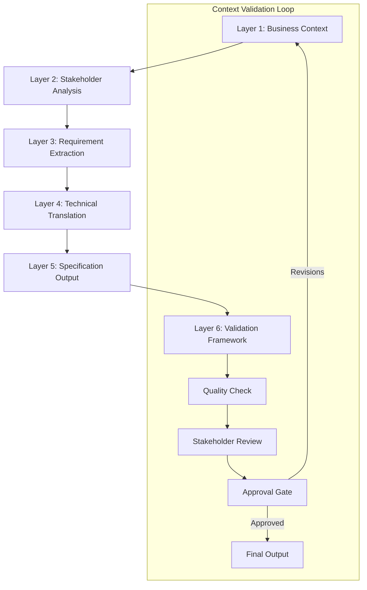

# Product Requirements Prompts (PRPs) - Advanced Context Engineering Framework

## Overview

Product Requirements Prompts (PRPs) is an advanced context engineering methodology that leverages AI agents to systematically gather, analyze, and refine product requirements through a structured 6-layer context flow. This framework is optimized for enterprise environments requiring high-quality, consistent, and traceable requirements engineering.

## 🎯 PRP Context Engineering Architecture

### Framework Principles

**Context Optimization**: Each layer builds upon previous context, minimizing redundancy while maximizing comprehension

**Agentic Design**: Specifically engineered for autonomous AI agent workflows with minimal human intervention

**Quality Assurance**: Built-in validation checkpoints ensure consistent, reliable outputs

**Stakeholder Alignment**: Multi-perspective integration with systematic stakeholder validation

**Performance Metrics**: Trackable success criteria and continuous improvement mechanisms

### 6-Layer Context Flow



---

## **Layer 1: Business Context Foundation** 🏢

### Context Engineering Objective

Establish comprehensive business foundation that drives all downstream requirements decisions with minimal token overhead and maximum AI comprehension.

### Core Context Components

#### Business Vision Framework

```yaml
# Optimized Business Context Structure
business_context:
  vision:
    statement: "[One-line compelling vision]"
    value_props: ["[Primary value]", "[Secondary values]"]
    outcomes: ["[Measurable outcome 1]", "[Measurable outcome 2]"]
    
  success_metrics:
    primary_kpi: "[KPI]: [Target] by [Date]"
    secondary_kpis: 
      - "[Metric 1]: [Target]"
      - "[Metric 2]: [Target]"
      
  constraints:
    regulatory: ["[Regulation]: [Requirement]"]
    market: "[Target segment] with [Size] market"
    technical: ["[Constraint 1]", "[Constraint 2]"]
    
  performance_targets:
    response_time: "[Target]ms"
    availability: "[Target]%"
    accuracy: "[Target]%"
```

#### AI Agent Prompting Pattern

```
ROLE_CONTEXT: Senior Business Analyst, 10+ years in [DOMAIN]
TASK_CONTEXT: Establish business foundation for [PRODUCT_NAME]
CONSTRAINT_CONTEXT: Must align with [BUSINESS_OBJECTIVES] within [REGULATORY_FRAMEWORK]

EXECUTION_FRAMEWORK:
1. Vision Analysis: Extract core value propositions from [VISION_STATEMENT]
2. Metrics Definition: Identify 3-5 measurable success criteria
3. Constraint Mapping: Document all regulatory and technical limitations  
4. Performance Baseline: Establish quantified performance targets
5. Validation: Ensure business context supports technical feasibility

OUTPUT_FORMAT: Structured YAML + Executive Summary (max 200 words)
QUALITY_CRITERIA: Specific, Measurable, Achievable, Relevant, Time-bound
```

### Expected Deliverables

**Business Context Package**:
- [ ] Vision statement (1 sentence, <20 words)
- [ ] Value propositions (3-5 items, prioritized)
- [ ] Success metrics (3-5 KPIs with targets)
- [ ] Constraint catalog (regulatory, technical, market)
- [ ] Performance targets (quantified, measurable)

---

## **Step 2: Stakeholder Analysis Layer** 👥

### Objective
Identify and analyze all stakeholders to ensure requirements address everyone's needs and constraints.

### Core Components

#### **Primary Users**
```yaml
User_Personas:
  Primary_User:
    Role: "[User role/title]"
    Responsibilities: "[Key responsibilities]"
    Pain_Points: 
      - "[Pain point 1]"
      - "[Pain point 2]"
    Goals:
      - "[Goal 1]"
      - "[Goal 2]"
    Technical_Proficiency: "[Beginner/Intermediate/Advanced]"
    
  Secondary_Users:
    - Role: "[Role]"
      Usage_Pattern: "[How they interact with product]"
      Influence_Level: "[High/Medium/Low]"
```

#### **Decision-Makers**
```yaml
Decision_Makers:
  Executive_Sponsor:
    Role: "[Title]"
    Authority_Level: "[Final/Approval/Advisory]"
    Success_Criteria: "[What they measure success by]"
    Constraints: "[Budget/Timeline/Resource constraints]"
    
  Technical_Lead:
    Role: "[Title]"
    Technical_Priorities: "[Performance/Security/Maintainability]"
    Architecture_Preferences: "[Technology preferences]"
    Risk_Tolerance: "[Conservative/Moderate/Aggressive]"
```

#### **Technical Constraints and Needs**
```yaml
Management_Requirements:
  Resource_Constraints:
    Budget: "[Available budget]"
    Timeline: "[Project timeline]"
    Team_Size: "[Available team members]"
    
  Technical_Constraints:
    Existing_Systems: "[Systems that must be integrated]"
    Technology_Stack: "[Required/Preferred technologies]"
    Security_Requirements: "[Security standards/compliance]"
    
  Operational_Needs:
    Maintenance_Windows: "[Available maintenance time]"
    Support_Model: "[24/7/Business hours/Self-service]"
    Training_Requirements: "[User training needs]"
```

### PRP Implementation Prompts

#### **Stakeholder Analysis Prompt:**
```
Acting as a Senior Business Analyst, help me conduct comprehensive stakeholder analysis for [PRODUCT_NAME].

Stakeholder Analysis Required:
1. Identify primary and secondary user personas
2. Map decision-makers and their authority levels
3. Analyze technical constraints from management perspective
4. Document conflicting requirements between stakeholder groups
5. Prioritize stakeholder needs based on influence and impact

For each stakeholder group, provide:
- Role and responsibilities
- Success criteria and pain points
- Technical constraints or preferences
- Decision-making authority
- Potential conflicts with other groups
```

### Expected Deliverables
- [ ] Complete stakeholder persona map
- [ ] Decision-maker authority matrix
- [ ] Technical constraints documentation
- [ ] Stakeholder influence/impact analysis
- [ ] Conflict identification matrix

---

## **Step 3: Requirement Extraction Layer** 📋

### Objective
Extract comprehensive functional and non-functional requirements from business context and stakeholder analysis.

### Core Components

#### **Functional Requirements**
```yaml
Functional_Requirements:
  Core_Features:
    Feature_1:
      Description: "[What the feature does]"
      User_Stories:
        - "As a [user type], I want [functionality] so that [benefit]"
      Business_Rules:
        - "[Rule 1]"
        - "[Rule 2]"
      Dependencies: "[Other features this depends on]"
      
  Supporting_Features:
    - Feature_Name: "[Name]"
      Priority: "[High/Medium/Low]"
      Complexity: "[Simple/Moderate/Complex]"
```

#### **Non-Functional Requirements**
```yaml
Performance_Requirements:
  Response_Time: "[Maximum acceptable response time]"
  Throughput: "[Requests per second/minute/hour]"
  Concurrent_Users: "[Maximum concurrent users]"
  
Reliability_Requirements:
  Availability: "[Uptime percentage target]"
  Error_Rate: "[Maximum acceptable error rate]"
  Recovery_Time: "[Maximum downtime for recovery]"
  
Security_Requirements:
  Authentication: "[Authentication method requirements]"
  Authorization: "[Access control requirements]"
  Data_Protection: "[Encryption and privacy requirements]"
  
Usability_Requirements:
  Learning_Curve: "[Time to proficiency for new users]"
  Accessibility: "[WCAG compliance level]"
  User_Interface: "[UI/UX standards and guidelines]"
```

#### **Integration and Interface Requirements**
```yaml
Integration_Requirements:
  External_Systems:
    System_1:
      Name: "[System name]"
      Integration_Type: "[API/File/Database/Message Queue]"
      Data_Format: "[JSON/XML/CSV/Binary]"
      Frequency: "[Real-time/Batch/On-demand]"
      
  APIs:
    Incoming_APIs:
      - Endpoint: "[API endpoint]"
        Method: "[GET/POST/PUT/DELETE]"
        Purpose: "[What it does]"
        
    Outgoing_APIs:
      - Target_System: "[System name]"
        Purpose: "[Integration purpose]"
        Data_Exchange: "[What data is exchanged]"
```

### PRP Implementation Prompts

#### **Requirement Extraction Prompt:**
```
As a Senior Requirements Engineer, help me extract comprehensive requirements for [PRODUCT_NAME] based on the business context and stakeholder analysis.

Requirements Extraction Needed:
1. Functional Requirements:
   - Core features that deliver primary value
   - Supporting features for complete user experience
   - Business rules and validation logic
   
2. Non-Functional Requirements:
   - Performance targets (response time, throughput)
   - Reliability requirements (availability, error handling)
   - Security and compliance requirements
   - Usability and accessibility standards
   
3. Integration Requirements:
   - External system integrations
   - API specifications (incoming/outgoing)
   - Data format and exchange requirements

For each requirement, provide:
- Clear description and acceptance criteria
- Priority level and business justification
- Dependencies and constraints
- Testability criteria
```

### Expected Deliverables
- [ ] Comprehensive functional requirements catalog
- [ ] Non-functional requirements specification
- [ ] Integration requirements matrix
- [ ] Requirements priority matrix
- [ ] Business rules documentation

---

## **Step 4: Technical Translation Layer** ⚙️

### Objective
Translate business and functional requirements into detailed technical specifications.

### Core Components

#### **API Specifications**
```yaml
API_Design:
  RESTful_APIs:
    Endpoint_1:
      Path: "[/api/v1/resource]"
      Method: "[HTTP method]"
      Purpose: "[Business function]"
      Request_Schema:
        - field_name: "[data type]"
        - field_name: "[data type]"
      Response_Schema:
        - field_name: "[data type]"
        - field_name: "[data type]"
      Error_Codes:
        - 400: "[Bad Request description]"
        - 401: "[Unauthorized description]"
        
  Authentication:
    Method: "[OAuth 2.0/JWT/API Key]"
    Token_Expiration: "[Time duration]"
    Refresh_Mechanism: "[How tokens are refreshed]"
```

#### **Data Model Design**
```yaml
Data_Models:
  Entity_1:
    Table_Name: "[database_table_name]"
    Fields:
      - name: "[field_name]"
        type: "[data_type]"
        constraints: "[NOT NULL/UNIQUE/FK]"
        purpose: "[Business purpose]"
    Relationships:
      - related_entity: "[Entity name]"
        relationship_type: "[One-to-Many/Many-to-Many]"
        
  Data_Flow:
    Input_Sources:
      - source: "[Data source]"
        format: "[Data format]"
        validation: "[Validation rules]"
    Processing_Rules:
      - transformation: "[Data transformation]"
        business_logic: "[Associated business rules]"
    Output_Destinations:
      - destination: "[Output system]"
        format: "[Output format]"
```

#### **Performance and Scalability Expectations**
```yaml
Performance_Architecture:
  Scalability_Targets:
    Horizontal_Scaling: "[Auto-scaling rules]"
    Vertical_Scaling: "[Resource limits]"
    Load_Distribution: "[Load balancing strategy]"
    
  Caching_Strategy:
    Cache_Layers:
      - layer: "[Application/Database/CDN]"
        duration: "[Cache expiration]"
        invalidation: "[Cache invalidation strategy]"
        
  Database_Performance:
    Query_Optimization: "[Indexing strategy]"
    Connection_Pooling: "[Connection pool configuration]"
    Partitioning: "[Data partitioning strategy]"
```

### PRP Implementation Prompts

#### **Technical Translation Prompt:**
```
As a Senior Software Architect, help me translate the business requirements into detailed technical specifications for [PRODUCT_NAME].

Technical Translation Required:
1. API Specifications:
   - RESTful API design with endpoints and methods
   - Request/response schemas and data validation
   - Authentication and authorization mechanisms
   - Error handling and status codes
   
2. Data Model Design:
   - Entity relationship diagrams
   - Database schema with constraints
   - Data flow and transformation rules
   - Data validation and integrity requirements
   
3. Performance Architecture:
   - Scalability design (horizontal/vertical)
   - Caching strategy and implementation
   - Database optimization approaches
   - Monitoring and alerting specifications

Ensure all technical specifications directly map to business requirements and performance targets.
```

### Expected Deliverables
- [ ] Complete API specification document
- [ ] Data model and schema design
- [ ] Performance architecture blueprint
- [ ] Technical constraint documentation
- [ ] Implementation roadmap

---

## **Step 5: Specification Output Layer** 📝

### Objective
Create detailed, actionable specifications ready for development and testing.

### Core Components

#### **User Stories**
```yaml
User_Story_Template:
  Story_ID: "[STORY-001]"
  Title: "[Brief story description]"
  
  Story: |
    As a [user type]
    I want [functionality]
    So that [business benefit]
    
  Acceptance_Criteria:
    - Given: "[Precondition]"
      When: "[Action]"
      Then: "[Expected result]"
      
  Definition_of_Done:
    - [ ] "[Completion criterion 1]"
    - [ ] "[Completion criterion 2]"
    - [ ] "[Testing criterion]"
    
  Technical_Notes:
    Implementation_Approach: "[Technical approach]"
    Dependencies: "[Technical dependencies]"
    Risks: "[Implementation risks]"
```

#### **Acceptance Criteria**
```yaml
Acceptance_Framework:
  Functional_Criteria:
    - Criterion: "[Specific functional requirement]"
      Test_Method: "[How to verify]"
      Success_Measure: "[What constitutes success]"
      
  Performance_Criteria:
    - Metric: "[Performance metric]"
      Target: "[Target value]"
      Measurement_Method: "[How to measure]"
      
  Security_Criteria:
    - Requirement: "[Security requirement]"
      Verification: "[How to verify compliance]"
      Standard: "[Security standard reference]"
```

#### **Technical Documentation/Specs**
```yaml
Technical_Specifications:
  Architecture_Document:
    System_Overview: "[High-level architecture]"
    Component_Diagram: "[Component relationships]"
    Deployment_Diagram: "[Deployment architecture]"
    
  Implementation_Guide:
    Development_Standards: "[Coding standards]"
    Testing_Strategy: "[Testing approach]"
    Deployment_Process: "[CI/CD pipeline]"
    
  Operations_Manual:
    Monitoring: "[Monitoring requirements]"
    Maintenance: "[Maintenance procedures]"
    Troubleshooting: "[Common issues and solutions]"
```

### PRP Implementation Prompts

#### **Specification Output Prompt:**
```
As a Senior Product Manager and Technical Writer, help me create comprehensive specifications for [PRODUCT_NAME] ready for development.

Specification Output Required:
1. User Stories:
   - Well-formed user stories with clear business value
   - Detailed acceptance criteria in Given-When-Then format
   - Definition of Done with measurable criteria
   - Technical implementation notes and dependencies
   
2. Acceptance Criteria:
   - Functional acceptance criteria with test methods
   - Performance criteria with specific targets
   - Security and compliance verification methods
   
3. Technical Documentation:
   - Architecture documentation with diagrams
   - Implementation guidelines and standards
   - Operations and maintenance procedures

Ensure all specifications are:
- Testable and measurable
- Traceable to business requirements
- Complete for development handoff
- Clear for all stakeholder types
```

### Expected Deliverables
- [ ] Complete user story backlog
- [ ] Detailed acceptance criteria
- [ ] Technical specification documents
- [ ] Implementation guidelines
- [ ] Testing and validation procedures

---

## **Step 6: Validation Framework Layer** ✅

### Objective
Ensure requirements are complete, consistent, and testable across all stakeholder groups.

### Core Components

#### **Completeness Coverage**
```yaml
Coverage_Analysis:
  Functional_Coverage:
    Business_Processes:
      - process: "[Business process]"
        coverage_percentage: "[XX%]"
        gaps: "[Identified gaps]"
        
    User_Journeys:
      - journey: "[User journey]"
        steps_covered: "[X of Y steps]"
        missing_steps: "[List of missing steps]"
        
  Technical_Coverage:
    System_Components:
      - component: "[System component]"
        requirements_count: "[Number]"
        specification_status: "[Complete/Partial/Missing]"
```

#### **Consistency Across Stakeholder Groups**
```yaml
Consistency_Matrix:
  Stakeholder_Alignment:
    Business_vs_Technical:
      aligned_requirements: "[List]"
      conflicting_requirements: "[List with resolution]"
      
    User_vs_Management:
      priority_alignment: "[High/Medium/Low]"
      expectation_gaps: "[Identified gaps]"
      
  Requirement_Consistency:
    Cross_References:
      - requirement_1: "[REQ-001]"
        related_requirements: "[REQ-002, REQ-003]"
        consistency_status: "[Consistent/Conflicting]"
```

#### **Testability Assessment**
```yaml
Testability_Framework:
  Functional_Testability:
    - requirement: "[Requirement description]"
      test_type: "[Unit/Integration/System/UAT]"
      test_criteria: "[Specific test criteria]"
      automation_feasibility: "[High/Medium/Low]"
      
  Performance_Testability:
    - metric: "[Performance metric]"
      measurement_method: "[How to measure]"
      test_environment: "[Environment requirements]"
      success_criteria: "[Pass/fail criteria]"
      
  Security_Testability:
    - security_requirement: "[Security requirement]"
      test_approach: "[Testing methodology]"
      tools_required: "[Testing tools]"
      compliance_verification: "[How to verify compliance]"
```

### PRP Implementation Prompts

#### **Validation Framework Prompt:**
```
As a Senior Quality Assurance Manager and Requirements Analyst, help me validate the completeness and quality of requirements for [PRODUCT_NAME].

Validation Required:
1. Completeness Coverage:
   - Verify all business processes are covered
   - Check user journey completeness
   - Identify gaps in technical specifications
   - Assess requirement traceability
   
2. Consistency Analysis:
   - Check alignment between stakeholder groups
   - Identify conflicting requirements
   - Verify priority consistency
   - Validate technical feasibility
   
3. Testability Assessment:
   - Evaluate testability of functional requirements
   - Assess performance testing feasibility
   - Verify security testing approach
   - Check automation potential

Provide:
- Coverage analysis with gap identification
- Consistency matrix with conflict resolution
- Testability assessment with recommendations
- Quality score and improvement suggestions
```

### Expected Deliverables
- [ ] Comprehensive coverage analysis
- [ ] Stakeholder consistency matrix
- [ ] Testability assessment report
- [ ] Quality validation scorecard
- [ ] Improvement recommendations

---

## 🔄 PRP Context Flow Integration

### Flow Execution Pattern
```
Business Context → Stakeholder Analysis → Requirement Extraction 
       ↓                    ↓                     ↓
Technical Translation → Specification Output → Validation Framework
       ↓                    ↓                     ↓
   [Feedback Loop] ← [Quality Gates] ← [Iteration Control]
```

### Quality Gates Between Steps
1. **Business → Stakeholder**: Business vision clarity and stakeholder identification completeness
2. **Stakeholder → Extraction**: Stakeholder needs understanding and conflict resolution
3. **Extraction → Translation**: Requirement clarity and technical feasibility
4. **Translation → Specification**: Technical accuracy and implementation readiness
5. **Specification → Validation**: Specification completeness and quality standards
6. **Validation → Iteration**: Quality acceptance or improvement identification

### Success Metrics
- **Completeness Score**: >95% coverage across all categories
- **Consistency Score**: >90% alignment between stakeholder groups
- **Testability Score**: >85% of requirements have defined test criteria
- **Quality Score**: >8/10 overall requirements quality rating

---

## 🎯 Implementation Best Practices

### 1. Progressive Refinement
- Start with high-level context in Step 1
- Add detail and specificity in each subsequent step
- Maintain traceability throughout the flow

### 2. Stakeholder Validation
- Validate outputs with relevant stakeholders at each step
- Resolve conflicts before proceeding to next step
- Document decisions and rationale

### 3. Iterative Improvement
- Use validation feedback to improve earlier steps
- Maintain version control for requirement evolution
- Track changes and impact analysis

### 4. Quality Assurance
- Apply quality gates between each step
- Use metrics to measure progress and quality
- Implement continuous improvement processes

---

**Last Updated**: August 27, 2025  
**Version**: 1.0  
**Framework**: Product Requirements Prompts (PRPs) - 6-Step Context Flow  
**Methodology**: AI-Assisted Requirements Engineering
